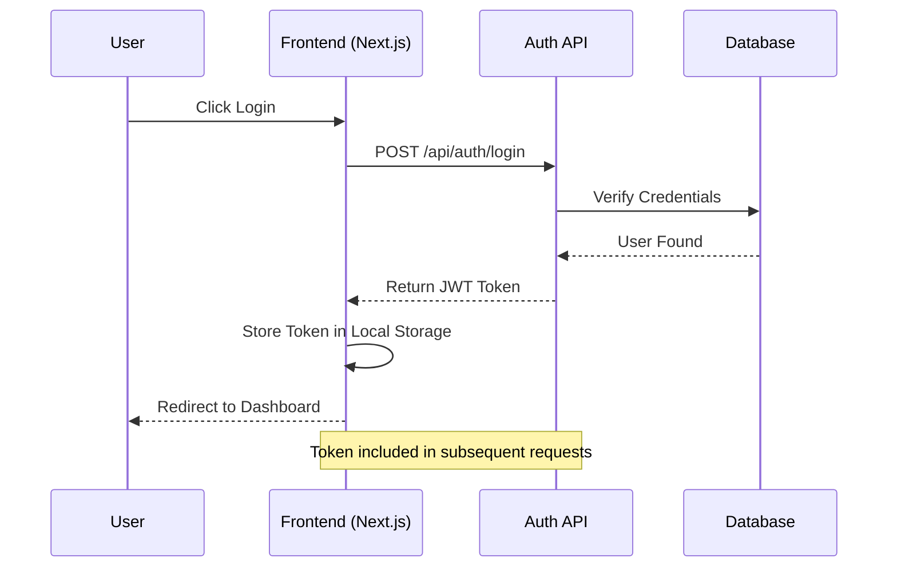

# Authentication Flow

This document describes the authentication flow between our Next.js frontend and the backend API.

## Login Sequence

```mermaid
sequenceDiagram
    participant U as User
    participant F as Frontend (Next.js)
    participant A as Auth API
    participant D as Database

    U->>F: Click Login
    F->>A: POST /api/auth/login
    A->>D: Verify Credentials
    D-->>A: User Found
    A-->>F: Return JWT Token
    F->>F: Store Token in Local Storage
    F-->>U: Redirect to Dashboard

    Note over F,A: Token included in subsequent requests
```
